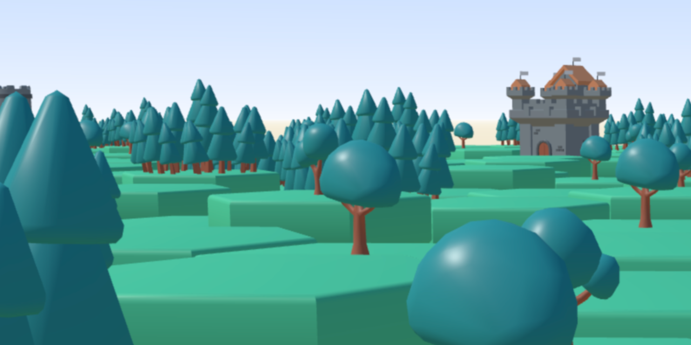

# 3D hex map




Just playing around with Three.js and TypeScript.

## Installation

This project uses TypeScript and Webpack. So installation is pretty simple:

```bash
  npm install
  npm start
```

## Acknowledgements

For this experiment i'm using Kay Lousberg's [Medieval Builder Pack](kaylousberg.com). 


[](http://www.wtfpl.net/)
